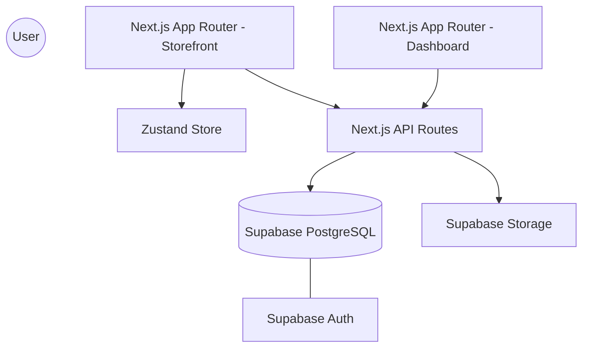
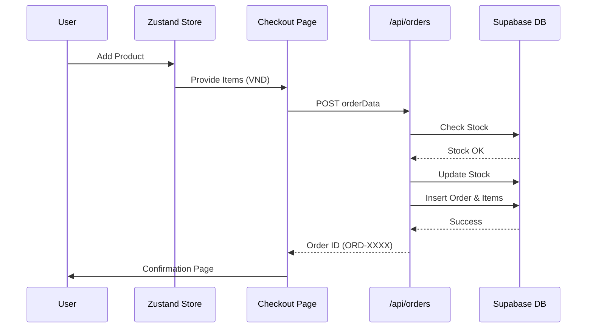
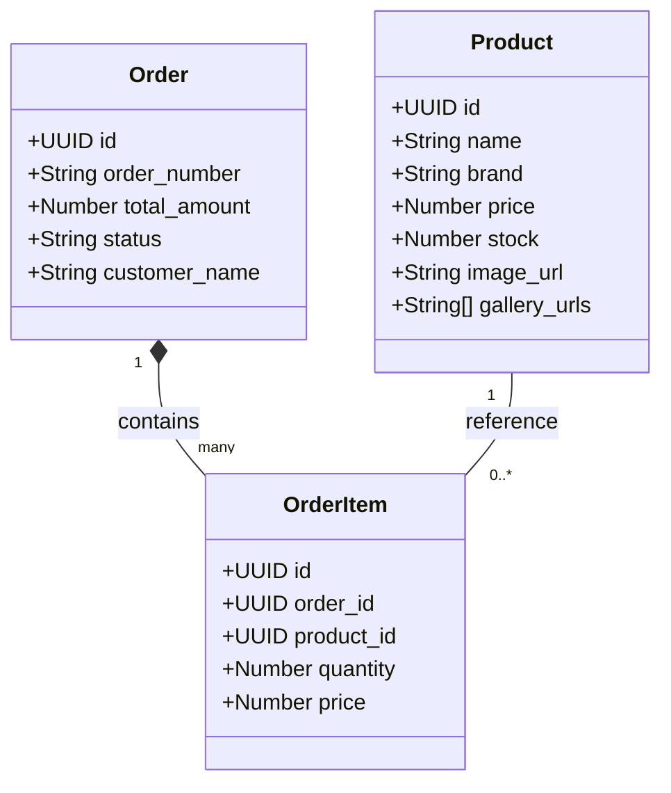
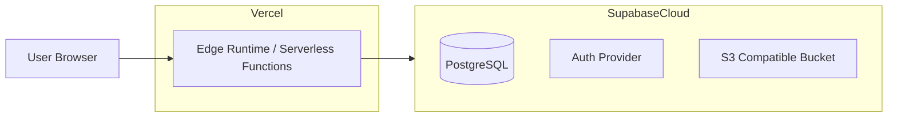

# Executive and Business Analysis of the Application – "Diecast Store"

This document is the result of the source code analysis of the Diecast Store system and covers the following areas:

- **Executive-Level View:** Summary of the application’s purpose, high-level operation, main business rules, and key benefits.
- **Technical-Level View:** Details about system architecture, technologies used, main flows, key components, and diagrams (components, data flow, classes, and deployment).
- **Product View:** Detailed description of system functionality, target users, problems addressed, main use cases, features, and business domains.
- **Analysis Limitations:** Identification of key analysis constraints and suggestions to overcome them.

The analysis was based on the available source code files.

---

## 1. Executive-Level View: Executive Summary

### Application Purpose
The **Diecast Store** is a specialized e-commerce and marketplace platform dedicated to premium model car collectors (ratios 1:64, 1:43, 1:18). It aims to provide a high-end, visually immersive environment for buying model cars and a "P2P Marketplace" where collectors can submit their own listings for review and sale.

### How It Works (High-Level)
1.  **Browse & Discover**: Users explore a curated collection of premium diecast models from top brands (MiniGT, Tarmac Works, Inno64).
2.  **Immersive Experience**: Each product features a high-performance smooth-scrolling gallery and interactive detail views.
3.  **Secure Checkout**: A streamlined checkout process handles order creation, stock verification, and customer data management through a custom Supabase backend.
4.  **Community Marketplace**: Collectors can "Transmit" their own albums/listings to the shop admin for verification and marketplace inclusion.

### High-Level Business Rules
-   **Stock Integrity**: Orders are only confirmed if live stock is available in the Supabase database. Stock is automatically decremented upon successful checkout.
-   **VND Localization**: All financial transactions and displays are strictly localized to Vietnamese Dong (VND) with thousands-separator masking for accuracy.
-   **Admin-Vetted Marketplace**: Peer-to-peer submissions are sent to a review queue (API endpoint) before appearing in the public gallery.
-   **"Save on Submit" Principal**: Data is only written to the database (Root CMS) when a transaction is finalized, ensuring high performance during browsing.

### Key Benefits
-   **Niche Focus**: Tailored specifically for the hobbyist community, avoiding generic e-commerce clutter.
-   **High Performance**: Uses Next.js App Router and Supabase for sub-second page loads and real-time inventory updates.
-   **Visual Excellence**: Implements modern design patterns (Glassmorphism, Particles.js, Keen Slider) to create a premium "vibe" that matches the high-end nature of the products.

---

## 2. Technical-Level View: Technology Overview

### System Architecture
The application follows a **Modern Monolithic Layout with Serverless API Routes** (Next.js App Router architecture). 
-   **Frontend**: React Server Components (RSC) for SEO and performance, combined with Client Components for interactive states.
-   **Backend**: Next.js API Routes (`/api/*`) acting as a bridge to Supabase.
-   **Database & Storage**: Supabase (PostgreSQL) for structured data and Supabase Storage for high-resolution images.

### Technologies Used (Technology Stack)
-   **Core**: Next.js 15+, React 19, TypeScript
-   **Database**: Supabase (PostgreSQL)
-   **Authentication**: Supabase Auth (Supporting Google & Email/Password)
-   **Styling**: Tailwind CSS
-   **State Management**: Zustand (with Persist middleware for Cart)
-   **Visual Effects**: Particles.js, Keen Slider (Infinite Loop Gallery), Lucide Icons
-   **Notifications**: React Hot Toast

### Main Technical Flows
1.  **Hydration Flow**: Upon entry, the Cart Store rehydrates from local storage and migrates any legacy Sanity IDs to the current Supabase standard.
2.  **Order Flow**: 
    -   Frontend: Calculates subtotal, tax (8%), and shipping (30,000 VND).
    -   API: Re-verifies stock in a transaction-like sequence, updates inventory, and creates `orders` / `order_items` records.
3.  **Media Flow**: Images are uploaded directly to Supabase Storage, and their public URLs are persisted in the PostgreSQL `products` or `market_items` tables.

### Key Components
-   **`CartStore` (Zustand)**: The central logic hub for item management, ID migration, and persistence.
-   **`ProductGallery`**: A specialized Keen Slider implementation for smooth, infinite-looping product displays.
-   **`Supabase Client/Server`**: Specialized instances for client-side interactions and secure server-to-server API calls.

### Code Complexity (Observations)
-   **Well-Structured**: Clear separation between `(store)` routes and `admin` dashboard.
-   **Modularized**: Utilities like `formatVND` and `constants` provide a single source of truth for localization.
-   **Higher Complexity Areas**: The `CartStore` contains critical migration logic to handle legacy data during the CMS transition.

### Diagrams

#### Component Diagram

#### Data Flow Diagram (Checkout)

#### Class/Interface Diagram (Simplified)

#### Simplified Deployment Diagram

---

## 3. Product View: Product Summary

### What the System Does (Detailed)
-   **Retail Catalog**: Displays a high-end catalog of diecast models with precise brand filtering.
-   **Shopping Experience**: Real-time cart management with price updates and stock warnings.
-   **Order Tracking**: Simple order confirmation and history (via `order-confirmation` routes).
-   **User Submissions**: Allows users to act as sellers by submitting their rare models to the store's "Marketplace" section.
-   **Admin Control**: Comprehensive dashboard to manage products, current inventory, and marketplace requests.

### Who the System Is For (Users / Customers)
-   **Primary End Users**: Diecast car collectors, specifically those interested in high-detail 1:64 scales.
-   **Secondary Users**: P2P Sellers looking for a professional platform to showcase and sell their collections.
-   **Admins**: Store owners managing stocks and fulfilling orders.

### Problems It Solves (Needs Addressed)
-   **Information Gap**: Provides high-resolution, multi-angle imagery for collectors who care about tiny details.
-   **Inventory Sync**: Solves the problem of "phantom sales" by checking live stock before any payment processing.
-   **Localization**: Offers a localized experience for the Vietnamese market (VND, local payment methods).

### Use Cases / User Journeys
-   **The Collector's Journey**: Landing Page -> Slick Gallery Click -> Add to Cart -> Detailed Address Entry -> COD Confirmation.
-   **The Seller's Journey**: Marketplace Tab -> "Transmit Album" -> Multi-image Upload -> Admin Review.

### Core Features
-   **Infinite Loop Gallery**: Visual continuity while browsing product images.
-   **VND Auto-Masking**: Error-free price entry for admins and sellers.
-   **Zustand Persist**: Keeps your cart safe even if you refresh or close the browser.
-   **Responsive Dark Mode**: Optimized for evening "browse & buy" behavior typical of collectors.

### Business Domains
-   **E-Commerce & Retail**
-   **Inventory Management**
-   **C2C/P2P Marketplace**

---

## Analysis Limitations

-   **Backend Obscurity**: While API routes are clear, any Supabase Edge Functions or complex RLS (Row Level Security) policies are only partially visible from the code and require DB access to verify fully.
-   **External APIs**: Payment gateway integrations (PayPal/Stripe) appear to be placeholders in the UI, suggesting they are pending or handled via manual Bank Transfer/COD as primary methods.
-   **Suggestions**: Implement a full audit of RLS policies within the Supabase dashboard and finalize the payment webhook integrations for automated processing.

---

**Executive and Business Analysis of the Application – "Diecast Store"**
*Date generated: 2026-03-23*
